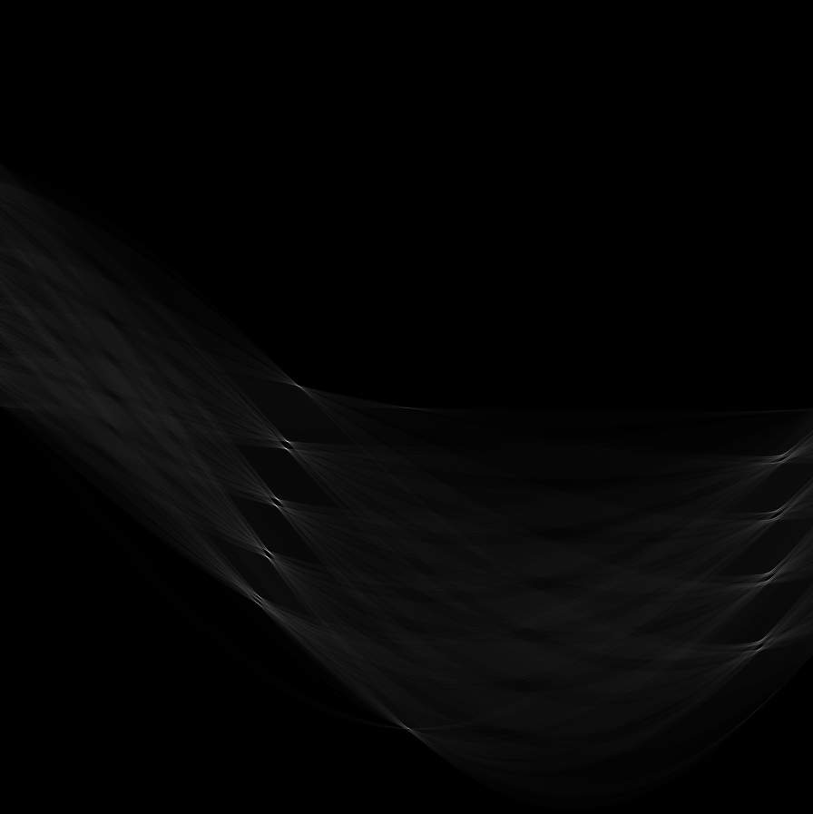

# Edge Detection in MatLab
The goal of this project was to build a script to detect edges in an image. We do this by first applying a Sobel filter and an inverse Sobel filter to determine X and Y gradients. From here we calculate the image magnitude and gradient direction. Since image magnitude well result in clusters of high-ranking pixels, we perform non-maximal suppression to supress (set to 0) neighbouring high ranking pixels. Then we perform a Hough transform which we use to generate Hough lines which we can use to markup the image with potential edges. 

# Prerequisites
MatLab

# Running: 
run ./matlab/houghscript.m

# Results: 
inside ./results/

Sobel Filter and Non-Maximal Supression Result:  
  
Thresholded Image Result:  

Hough Transform:  

Predicted Edges:  
